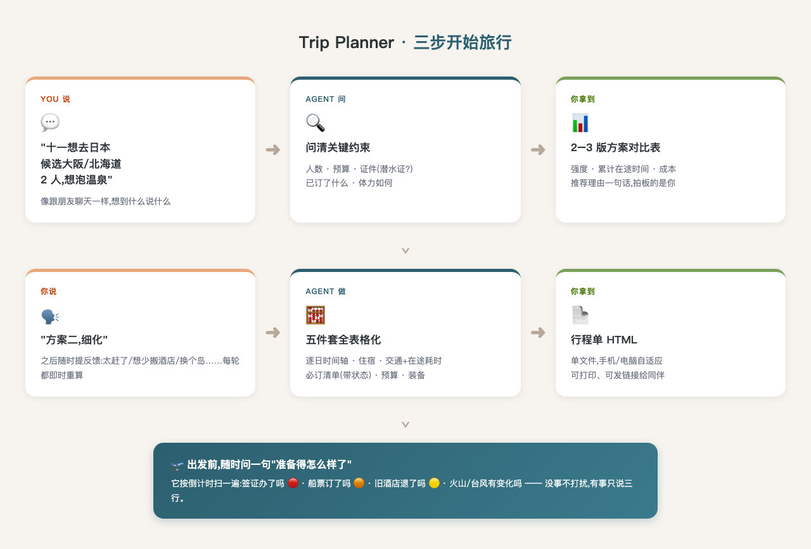
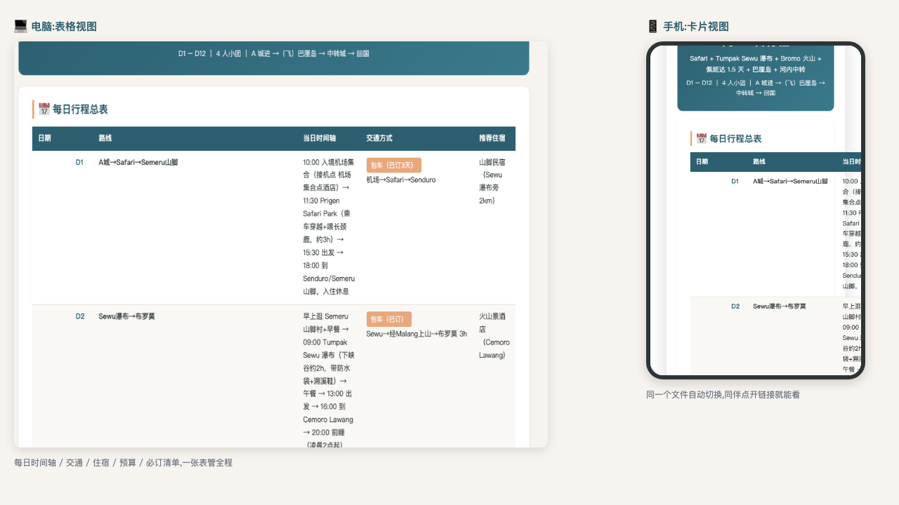

# Travel Planner Agent ✈️

> 和 AI 一起规划旅行:你说想去哪,它来算路线、比方案、盯风险、盯签证,最后给你一张能直接发给同伴的行程单。

[English intro below]

## 使用流程

**你只需要做一件事:像聊天一样,把想去的地方告诉它。**



三步,每步你拿到什么:

| 步 | 你说什么 | 你拿到什么 |
|---|---|---|
| 1️⃣ 比方案 | "十一想去日本,候选大阪/北海道,2人,想泡温泉" | 2–3 版方案对比表(强度/在途时间/成本),你拍板 |
| 2️⃣ 细化 | "方案二,细化" + 随时反馈("太赶了""想少搬酒店") | 逐日时间轴/住宿/交通/必订清单/预算,全表格化 |
| 3️⃣ 出发前 | "帮我看看准备得怎么样了" | 三行就绪度报告:🔴逾期 🟠临期 🟡待退 |

**对话即操作,表格即答案。** 突发情况(航变/景点关闭/台风)时,它会只重排受影响段、列好退订清单、给 A/B 方案。

## 你会拿到什么

| 产物 | 长什么样 | 什么时候有 |
|---|---|---|
| **方案对比表** | 2–3 版行程,强度/在途时间/成本并排比 | 第 1–2 轮对话后 |
| **行程单 HTML** | 单文件网页:每日时间轴、住宿、交通、预算、必订清单;手机变卡片、电脑变表格,打印友好 | 你选定方案后 |
| **就绪度报告** | 三行式检查单,逾期/临期/待退一目了然 | 出发前,随时问 |
| **风险预案** | 火山关闭/台风/航变发生时,A/B 方案+决策时间点 | 出状况时 |

> 行程单效果(桌面表格 ↔ 手机卡片同一文件自适应):



## 快速开始(接入 Claude Code)

```bash
git clone https://github.com/<you>/travel-planner.git
cd travel-planner

# 安装 skill(一行)
mkdir -p ~/.claude/skills/trip-planner
cp agent/SKILL.md ~/.claude/skills/trip-planner/SKILL.md
```

然后打开 Claude Code,像平时聊天一样:

```
帮我规划十一的日本行程,候选大阪/北海道,2 人,想泡温泉,预算人均 1 万
```

完整的规划指令(它内部怎么想)在 [agent/SKILL.md](agent/SKILL.md);出发前的就绪度检查设计在 [agent/OPTIMIZER.md](agent/OPTIMIZER.md)。

## 两个真实案例

| | 🏝️ 巴厘岛 12 天 | 🌾 草原自驾 2 天 |
|---|---|---|
| 展示什么 | 28 轮反馈迭代、航变重规划、火山关闭应对 | 5 轮搞定、实时天气驱动的换方向 |
| 亮点 | 砍科莫多的取舍逻辑、预订状态机、风险决策点 | 「单人驾驶」一个约束撑起整个设计 |
| 复盘 | [bali-2026-iteration-log.md](case-study/bali-2026-iteration-log.md) | [beijing-grassland-2026-iteration-log.md](case-study/beijing-grassland-2026-iteration-log.md) |

(案例中的日期、酒店名等个人信息已脱敏)

## 方法论(它为什么好用)

提炼自上述案例,共 11 条,全文见 [agent/SKILL.md](agent/SKILL.md),几条最核心的:

- **约束优先**:已订的机票酒店是不可变量,先提取再规划;你只给一个约束(如"单人开车"),它就把它变成全行程的结构参数
- **在途时间是第一指标**:每段交通都标耗时,累计值超过阈值主动预警——行程质量的瓶颈往往不是"玩得不够多",而是"喘不过气"
- **诚实反馈**:方案物理上不可行时直说"2 天只能打卡",不硬塞时间表
- **事件驱动重规划**:航变/景点关闭/酒店变动 → 只重排受影响段,列退订清单,给 2 方案对比

## English Intro

A human-in-the-loop travel planning agent distilled from two real trips: a 12-day Indonesia journey (28+ feedback iterations, flight-change & volcanic-eruption replanning) and a 48-hour grassland roadtrip (real-time weather-driven destination switching). Talk to it like a friend, get comparison tables, a single-file responsive HTML itinerary, and pre-departure readiness checks.

## License

MIT
